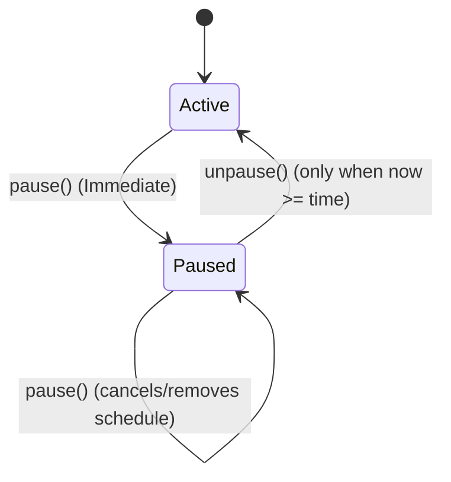

# Emergency Killswitch: Unpause Timelock Design

## Overview
To prevent rapid-cycle oscillations (rapidly enabling/disabling the pause state) and accidental premature unpauses by administrators during incidents, the `emergency_killswitch` contract implements an **Unpause Timelock**. 

When a critical system incident occurs, an operator immediately pauses the contract to protect user funds. Once the incident is resolved, a mandatory cooling-off window is enforced before the system can be unpaused. This gives operators, auditors, and monitoring systems sufficient time to verify the fix and prepare for normal operations.

---

## Timelock Architecture

The timelock architecture relies on the following contract endpoints and state invariants:

### 1. State Representation (`DataKey`)
The scheduling state is stored within the contract instance storage using the `DataKey` enum:
- `DataKey::UnpauseSchedule`: Stores the future unpause timestamp (`u64`). If no unpause is scheduled, this key is not present.
- `DataKey::GlobalPaused`: Represents whether the global contract functionality is currently paused (`bool`).

### 2. Actions & Invariants

#### A. Global Pause (`pause`)
- **Action**: Halt all contract operations immediately.
- **Invariant**: Any call to `pause()` automatically cancels and removes any pending schedule stored in `DataKey::UnpauseSchedule`. This ensures that if the system is re-paused during an incident, an old scheduled unpause cannot be used to bypass the cooling-off window.

#### B. Schedule Unpause (`schedule_unpause`)
- **Action**: Register a future timestamp for when the system is eligible to be unpaused.
- **Invariant**: The scheduled time must be in the future relative to the current ledger timestamp. The contract rejects any past-dated schedules (`time < env.ledger().timestamp()`) with an `Error::InvalidSchedule`. This prevents bypassing the timelock with a past timestamp.

#### C. Unpause (`unpause`)
- **Action**: Lift the global pause state and return the contract to active status.
- **Invariant**: The unpause action cannot take effect before the scheduled time. The `unpause()` function enforces `env.ledger().timestamp() >= scheduled_time` using the value stored under `DataKey::UnpauseSchedule`. If no schedule is active, `unpause()` fails with `Error::InvalidSchedule`.

#### D. Read-Only Query (`is_paused`)
- **Action**: Returns the current pause status.
- **Invariant**: The return value of `is_paused()` remains `true` throughout the incident and the cooling-off window. It only returns `false` *after* the `unpause()` function has been successfully executed by the admin after the timelock expires.

---

## Error Codes
- `Error::Unauthorized` (1): Returned when the caller is not the admin, or if `unpause()` is called before the scheduled timelock expires.
- `Error::InvalidSchedule` (5): Returned when `schedule_unpause()` is called with a past-dated timestamp, or when `unpause()` is called without a valid scheduled time.

---

## Security Verification and Testing
All invariants are verified by robust unit tests in `emergency_killswitch/tests/test_killswitch.rs`:
1. **`test_premature_unpause_rejection`**: Verifies that calling `unpause()` before the scheduled timestamp fails with `Error::Unauthorized`.
2. **`test_re_pause_cancels_schedule`**: Verifies that calling `pause()` cancels any pending unpause schedule, causing subsequent `unpause()` calls to fail with `Error::InvalidSchedule` even if the ledger moves past the originally scheduled timestamp.
3. **`test_timelock_bypass_rejection`**: Verifies that past-dated schedules are immediately rejected by `schedule_unpause()`.
4. **Boundary conditions**: Validates that unpause is successful exactly at the boundary of the scheduled timestamp (`ledger.timestamp() == scheduled_time`).
